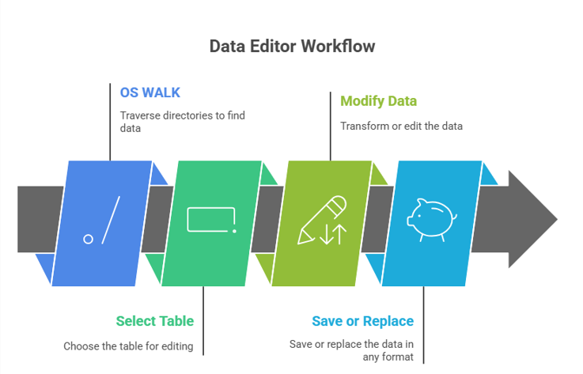
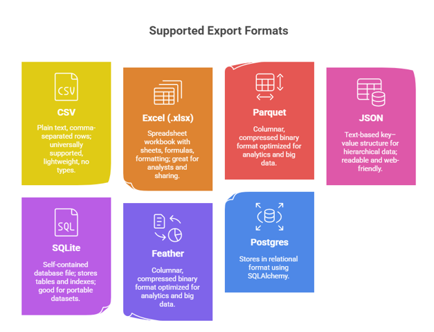

    
# Data Editor 

## Streamlit app for editing and persisting changes to data

    

    

# 🧠 Data Editor  

Streamlit application for **editing and persisting changes to data** in a browser

## 🔄 Data Editor Workflow

1. **OS WALK** - walks the target directories looking for data to edit
2. **Select Table** - select the table you want to edit
3. **Modify Data** - Transform or edit the data in any way you see fit
4. **Save or Replace** - Save or replace the data in any format 

## ✅ Flexible workflow

1. Can rename files and convert between formats
2. Option to overwrite or create new files

## Loads Data  - Import formats  

1. CSV / TXT
2. Excel (XLS, XLSX)
3. Parquet (PARQUET, PQ)
4. JSON
5. Pickle (pickle,pkl)
5. Feather (feather) 

## 🔎 Filters and selects files

1. Provides filename search/filtering
2. Lets the user choose a file to edit

## 📊 Loads the selected file into a pandas DataFrame for display

1. ✏️ Interactive editing
2. Uses Streamlit’s st.data_editor to let the user view and modify the DataFrame directly in the browser

## 💾 Saving options

1. Overwrite the original file in its same format (if supported)
2. Save As: choose any destination folder, filename, and format

# 🧩 Output formats

1. **CSV** — Plain text, comma-separated rows; universally supported, lightweight, no types.
2. **Excel (.xlsx)** — Spreadsheet workbook with sheets, formulas, formatting; great for analysts and sharing.
3. **Parquet** — Columnar, compressed binary format optimized for analytics and big data.
4. **JSON** — Text-based key–value structure for hierarchical data; readable and web-friendly.
5. **SQLite (table name user-specified)** — Self-contained database file; stores tables and indexes; good for portable datasets.

Welcome to the solution **Data Editor** - an example for your projects

Streamlit app for editing and persisting changes to data

 

# 🧠 Data Editor  

Streamlit application for **editing and persisting changes to data** in a browser

## 🔄 Data Editor Workflow

1. **OS WALK** - walks the target directories looking for data to edit
2. **Select Table** - select the table you want to edit
3. **Modify Data** - Transform or edit the data in any way you see fit
4. **Save or Replace** - Save or replace the data in any format 

## ✅ Flexible workflow

1. Can rename files and convert between formats
2. Option to overwrite or create new files

## Loads Data  - Import formats  

1. CSV / TXT
2. Excel (XLS, XLSX)
3. Parquet (PARQUET, PQ)
4. JSON
5. Pickle (pickle,pkl)
5. Feather (feather) 

## 🔎 Filters and selects files

1. Provides filename search/filtering
2. Lets the user choose a file to edit

## 📊 Loads the selected file into a pandas DataFrame for display

1. ✏️ Interactive editing
2. Uses Streamlit’s st.data_editor to let the user view and modify the DataFrame directly in the browser

## 💾 Saving options

1. Overwrite the original file in its same format (if supported)
2. Save As: choose any destination folder, filename, and format

# 🧩 Output formats

1. **CSV** — Plain text, comma-separated rows; universally supported, lightweight, no types.
2. **Excel (.xlsx)** — Spreadsheet workbook with sheets, formulas, formatting; great for analysts and sharing.
3. **Parquet** — Columnar, compressed binary format optimized for analytics and big data.
4. **JSON** — Text-based key–value structure for hierarchical data; readable and web-friendly.
5. **SQLite (table name user-specified)** — Self-contained database file; stores tables and indexes; good for portable datasets.

 

    

    
## Getting Started

The goal of this solution is to **Jump Start** your development and have you up and running in 30 minutes. 

To get started with the **Data Editor** solution repository, follow these steps:
1. Clone the repository to your local machine.
2. Install the required dependencies listed at the top of the notebook.
3. Explore the example code provided in the repository and experiment.
4. Run the notebook and make it your own - **EASY !**
    
## Solution Features

- Easy to understand and use  
- Easily Configurable 
- Quickly start your project with pre-built templates
- Its Fast and Automated
- Saves You Time 

## ⚙️ Key Features

- ✅ **Self Documenting** Automatically identifies and annotates major steps in a notebook, making the codebase readable and well structured.
- ✅ **Self Testing** Includes built in **unit tests** for each function to validate logic and ensure code reliability.
- ✅ **Easily Configurable** Uses a simple **config.ini** file for centralized settings and easy customization through key value pairs.
- ✅ **Talking Code** explains itself through inline commentary, helping you understand both **what** it does and **why** it does it.
- ✅ **Self Logging** extends Python’s standard **logging** module for **step by step runtime insights**.
- ✅ **Self Debugging** Includes debugging hooks and detailed error tracing to simplify development and troubleshooting.
- ✅ **Low Code or  No Code** Designed to minimize complexity — most full solutions are under 50 lines of code.
- ✅ **Educational** Each template includes educational narrative and background context to support learning, teaching, and collaborative development.

    