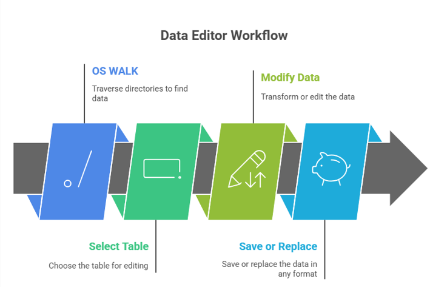
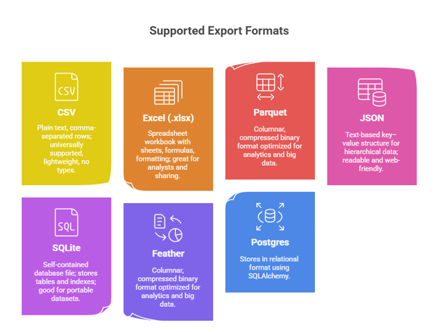

# 🧠 Data Editor  

Streamlit application for **editing and persisting changes to data** in a browser

## 🔄 Data Editor Workflow

1. **OS WALK** - walks the target directories looking for data to edit
2. **Select Table** - select the table you want to edit
3. **Modify Data** - Transform or edit the data in any way you see fit
4. **Save or Replace** - Save or replace the data in any format 

## ✅ Flexible workflow

1. Can rename files and convert between formats
2. Option to overwrite or create new files

## Loads Data  - Import formats  

1. CSV / TXT
2. Excel (XLS, XLSX)
3. Parquet (PARQUET, PQ)
4. JSON
5. Pickle (pickle,pkl)
5. Feather (feather) 

## 🔎 Filters and selects files

1. Provides filename search/filtering
2. Lets the user choose a file to edit

## 📊 Loads the selected file into a pandas DataFrame for display

1. ✏️ Interactive editing
2. Uses Streamlit’s st.data_editor to let the user view and modify the DataFrame directly in the browser

## 💾 Saving options

1. Overwrite the original file in its same format (if supported)
2. Save As: choose any destination folder, filename, and format

# 🧩 Output formats

1. **CSV** — Plain text, comma-separated rows; universally supported, lightweight, no types.
2. **Excel (.xlsx)** — Spreadsheet workbook with sheets, formulas, formatting; great for analysts and sharing.
3. **Parquet** — Columnar, compressed binary format optimized for analytics and big data.
4. **JSON** — Text-based key–value structure for hierarchical data; readable and web-friendly.
5. **SQLite (table name user-specified)** — Self-contained database file; stores tables and indexes; good for portable datasets.

